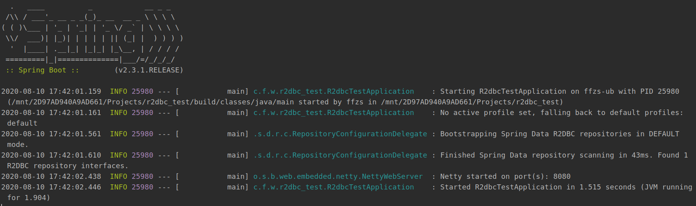
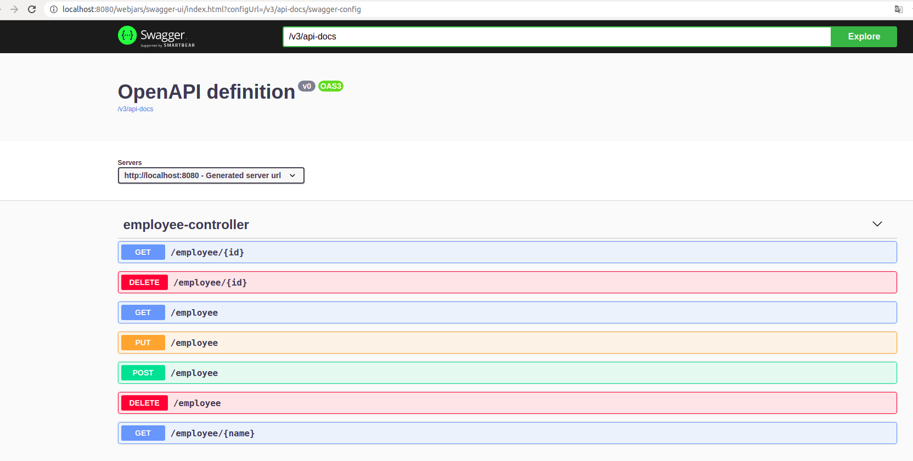
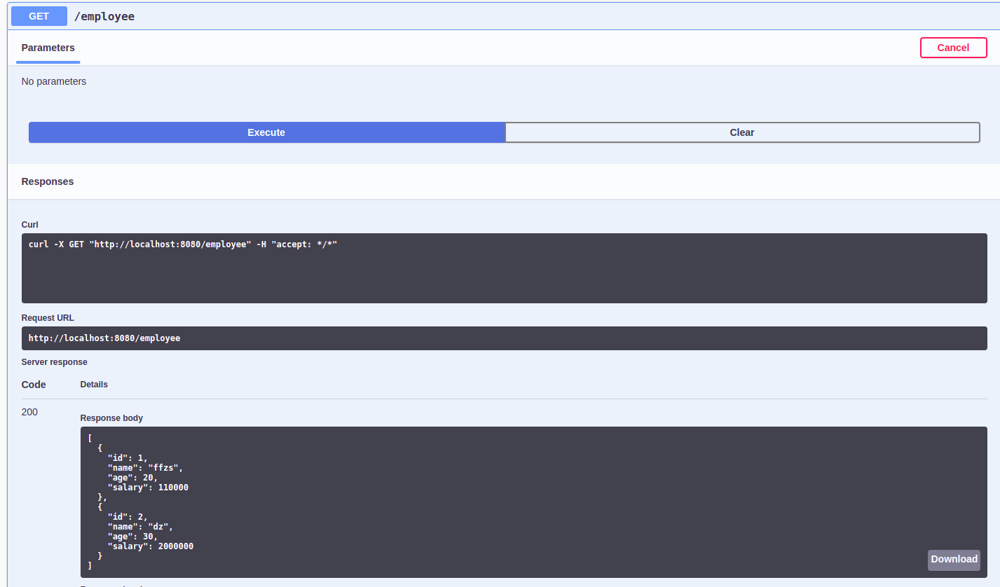
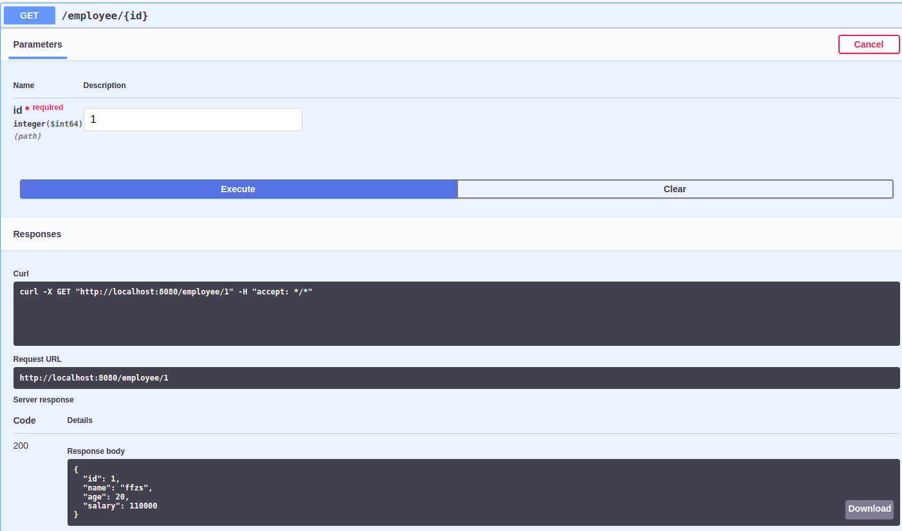
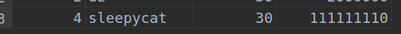
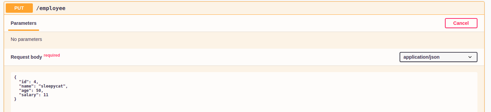
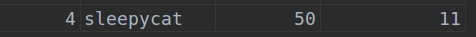
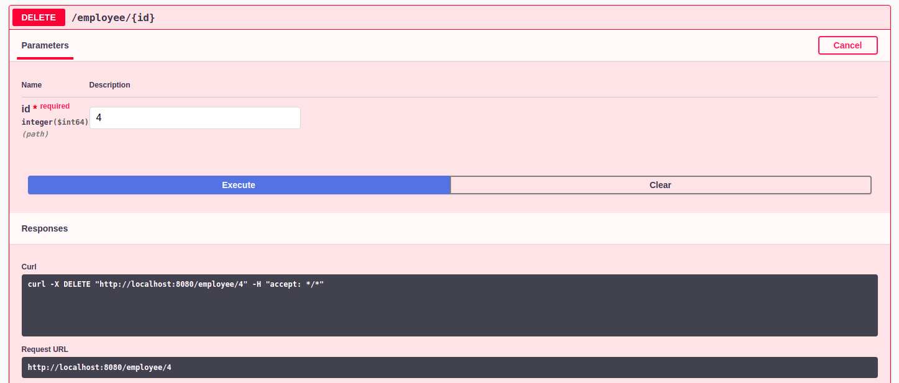
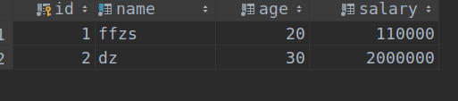

# Spring WebFlux (1):   r2dbc+mysql+springdoc 创建 RESTful api

随着响应式编程在网络编程中使用越发的普及，mysql等一系列的关系型数据库也在r2dbc等包的帮助下支持响应式。虽然响应式跟原来的sevlet的写法区别比较大，但是spring尽量保持原来的风格，编写control层和service层的方法跟原来基本相同，略有区别就是controller返回的Mono或是Flux。特别是对crud的支持，跟原来的jpa基本相同。

## 例子：

### 1、创建table

 在mysql数据库中创建一个命名为mydb的数据库，然后创建一个命名为employee的表用于测试， 字段内容如下：

+ id 
+ name： 员工姓名
+ age：员工年龄
+ salary：员工薪酬

```sql
CREATE DATABASE IF NOT EXISTS mydb;
USE mydb;

DROP TABLE IF EXISTS `employee`;
CREATE TABLE `employee` (
                          `id` bigint(20) NOT NULL AUTO_INCREMENT,
                          `name` varchar(100) NOT NULL,
                          `age` int(11) NOT NULL,
                          `salary` bigint(20) NOT NULL,
                          PRIMARY KEY (`id`),
                          UNIQUE KEY `name` (`name`)
) ENGINE=InnoDB DEFAULT CHARSET=utf8;

BEGIN;
INSERT INTO `employee` VALUES ('1', 'ffzs', '20', '110000'), ('2', 'dz', '30', '2000000');
COMMIT;
```


### 2、创建spring项目

使用gradle维护项目，使用的支持:

```java
dependencies {
    implementation 'org.springframework.boot:spring-boot-starter-data-r2dbc'
    implementation 'org.springframework.boot:spring-boot-starter-webflux'
    compileOnly 'org.projectlombok:lombok'
    runtimeOnly 'dev.miku:r2dbc-mysql'
    runtimeOnly 'mysql:mysql-connector-java'
    annotationProcessor 'org.projectlombok:lombok'
    testImplementation('org.springframework.boot:spring-boot-starter-test') {
        exclude group: 'org.junit.vintage', module: 'junit-vintage-engine'
    }
    testImplementation 'io.projectreactor:reactor-test'
}
```


### 3、编写配置文件

主要配置mysql的链接，r2dbc链接的url跟jdbc的略有不同，需要注意

application.yml

```yml
spring:
  r2dbc:
    url: r2dbcs:mysql://localhost:3306/mydb?useUnicode=true&zeroDateTimeBehavior=convertToNull&autoReconnect=true&characterEncoding=utf-8
    username: root
    password: 123zxc
```

### 4、编写model类

Employee.class

```java
import lombok.*;
import org.springframework.data.annotation.Id;
import org.springframework.data.relational.core.mapping.Table;

@Data
@AllArgsConstructor
@NoArgsConstructor
@Builder
@With
@Table("employee")
public class Employee {

  @Id
  private long id;
  private String name;
  private long age;
  private long salary;
}
```

### 5、 dao层编写

跟jpa使用基本相同，不过这里继承的事响应式的crud类`ReactiveCrudRepository`

```java
public interface EmployeeDao extends ReactiveCrudRepository<Employee, Long> {
    
    Flux<Employee> findByName(String name);

}
```

### 6、service层编写

+ 编写了常见的增删改查的功能
+ 跟之前的不同之处是这里返回的值为Reactor的对象Flux或Mono

```java
@Service
@RequiredArgsConstructor
public class EmployeeService {

    private final EmployeeDao employeeDao;

    public Flux<Employee> findAll () {
        return employeeDao.findAll();
    }

    public Mono<Employee> findById (long id) {
        return employeeDao.findById(id);
    }

    public Flux<Employee> findByName (String name) {
        return employeeDao.findByName(name);
    }

    public Mono<Employee> save (Employee employee) {
        return employeeDao.save(employee);
    }

    public Mono<Void> update (Employee employee) {
        return findById(employee.getId())
                .map(em -> employee.withId(em.getId()))
                .flatMap(employeeDao::save)
                .then();
    }

    public Mono<Void> delete (Employee employee) {
        return employeeDao.delete(employee);
    }

    public Mono<Void> deleteById (long id) {
        return employeeDao.deleteById(id);
    }
}
```

### 7、controller层编写

+ 应用RESTful api 特点，一个路由可以有get，post，put，delete四种功能
+ 跟service层对应实现增删改查的功能

```java
@RestController
@RequiredArgsConstructor
@RequestMapping("employee")
@Slf4j
public class EmployeeController {

    private final EmployeeService employeeService;

    @GetMapping
    public Flux<Employee> findAll() {
        return employeeService.findAll();
    }

    @GetMapping (path = "{id}")
    public Mono<Employee> findById(@PathVariable("id") long id) {
        return employeeService.findById(id);
    }

    @GetMapping (path = "{name}")
    public Flux<Employee> findByName(@PathVariable("name") String name) {
        return employeeService.findByName(name);
    }

    @PostMapping
    @ResponseStatus(HttpStatus.CREATED)
    public Mono<Employee> save(@RequestBody Employee employee) {
        return employeeService.save(employee);
    }

    @PutMapping
    @ResponseStatus(HttpStatus.NO_CONTENT)
    public Mono<Void> update (@RequestBody Employee employee) {
        return employeeService.update(employee);
    }

    @DeleteMapping
    @ResponseStatus(HttpStatus.NO_CONTENT)
    public Mono<Void> delete (@RequestBody Employee employee) {
        return employeeService.delete(employee);
    }

    @DeleteMapping(path = "{id}")
    @ResponseStatus(HttpStatus.NO_CONTENT)
    public Mono<Void> deleteById (@PathVariable long id) {
        return employeeService.deleteById(id);
    }
}
```

### 8、测试

项目集成springdoc的openapi（可以理解为swagger）进行api接口测试，添加依赖：

```java
implementation 'org.springdoc:springdoc-openapi-webflux-ui:1.4.1'
```

不用做任何修改直接运行项目即可, 成功启动:



访问swagger测试页面 `http://localhost:8080/swagger-ui.html`，就会完成跳转到测试页面：



#### 测试findAll



#### 测试findById



测试save功能




添加成功

#### 测试update功能





修改成功

#### 测试delete功能





id为4的员工记录没有了说明删除成功。


## 代码

github